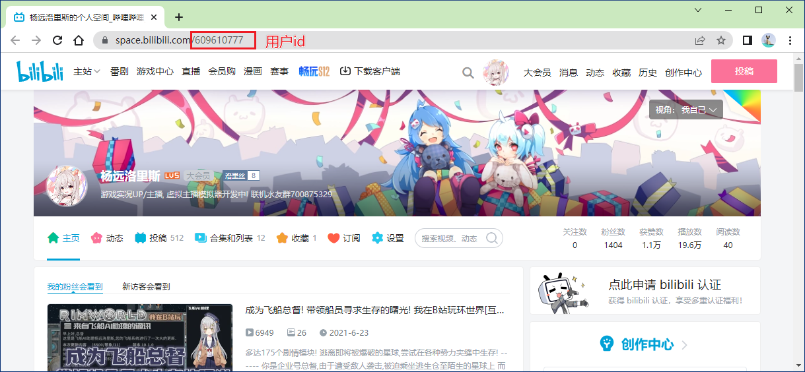

# YoungerDM
杨远直播弹幕插件 支持显示弹幕和礼物等

## 例图

注: 使用OBS等捕获后不会有上面那个display字样

### 支持修改任意大小

### 送礼自然也不在话下

根据礼物价值提高显示时长(未来将会支持自定义)

## 使用方法

### 初次使用

下载 最新版本 [Release.zip](https://github.com/LorisYounger/YoungerDM/releases)

下载 B站弹幕姬 https://www.danmuji.org/

选择 **外挂程序 **-> **打开外挂程序资料夹** 将 [Release.zip](https://github.com/LorisYounger/YoungerDM/releases) 解压到该文件夹

重启弹幕姬,即可看到杨远弹幕插件,右键选择启用即可

选择管理可以进入管理界面

### 管理界面

1. 打开设置文件目录: 可以打开杨远弹幕插件的设置文件夹,可以自行修改配置等
2. 更新用户头像: 见 更新用户头像
3. 生成感谢名单: 为下播生成感谢名单,如例子下图所示,根据贡献点数排名先后(贡献点数不显示)

### 更新用户头像

更新用户头像需要2个参数,用户ID和COOKIE

**左侧文本框**填写 **用户ID**

可以在个人主页找到

**右侧文本框**填写 **Cookie**

Cookie 找起来比较麻烦,**!请注意不要把自己的Cookie给任何人!Cookie约等于账号密码**

首先打开个人主页, 按 **键盘F12** 进入控制台页面如图所示

首先点击 1.网络标签

然后点击 2.刷新 刷新网页

最后点击 3. 排名第一项的栏 为用户ID

点击后会出现类似下图页面

然后通过滚轮往下拉,找到 Cookie 字样

右键该栏,复制,粘贴到软件第二个文本框即可

最后,点击 更新用户头像即可更新用户头像
